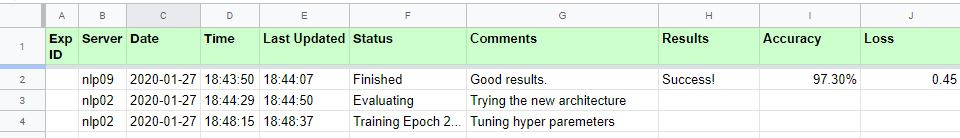
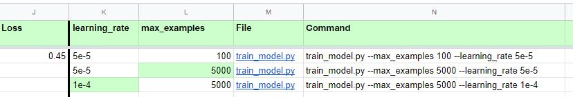

# Google Spreadsheet Utils
Managing experiments with google spreadsheets API

## What is it?
This library enables managing your experiments using a google spreadsheet. You'll be able to:
* Document each experiment in a row, containing all of the experiments parameters (including those from the command line)
* Add real-time updates to each experiment, e.g. 'starting 2nd Epoch', 'Eval #1 Accuracy: 92.3%', etc.
* Make manual changes to the table
* Add comments to the experiments
* Easily notice the differences between the different parameters of each run (colored in light green)




## Getting Started

### 1) Enable Google API. 
Follow Steps 1 and 2 in the instructions [here](https://developers.google.com/sheets/api/quickstart/python).
Important: while doing so, locate the file 'credentials.json' in your working directory. The python program will need it.

### 2) Create a copy of the spreadsheet
Notice how you name it. We'll soon use it. You can make a copy from this [sheet](https://docs.google.com/spreadsheets/d/1xPF3Ji1GSgHlA92LCotzDEj1QEKOMajRQimZi9LI2h8/edit?usp=sharing)

### 3) Share your spreadsheet
From the Google spreadsheet, click the 'Share' button and add the email address that appears under "client_email"in the json file you've downloaded.


That's it. You're ready to go.
Now try running [gsheet_util_example.py](gsheet_util_example.py):
```
import gsheets_utils as gu
import socket
import argparse
import time

MySheetName = 'my_experiments'  # change to your Spreadsheet name
# key_filename = '[...].json' # the name of the file you've downloaded when enabling the API
key_filename = 'testpython-4005dcd556f7.json'

start_time = gu.now_str()
server_name = socket.gethostname()

# defining and parsing input arguments
parser = argparse.ArgumentParser()
parser.add_argument("--learning_rate", default=2e-5, type=str, required=True, help="Training learning rate.")
parser.add_argument("--max_examples", default=100, type=str, help="maximum number of training examples.")
args = parser.parse_args()


data = {arg:val for arg, val in args._get_kwargs()}

print("Adding a line to google spreadsheet %s"%MySheetName)
gse = gu.GSpreadExperiment(MySheetName, key_filename, start_time, server_name, data, first_status='started training')
# ... training....

time.sleep(5)      # look at the spreadsheet and see it changes after the next call: gse.update (below)

# ...
epoch1_acc = 0.87
accuracy = 0.91
loss = 0.36
# ...

# Updating the existing columns 'Accuracy', 'Loss' and 'Status', and adding a new column 'Epoch1'
print("Updating the existing columns 'Accuracy', 'Loss' and 'Status', and adding a new column 'Epoch1'...")
gse.update({'Accuracy':accuracy, 'Loss':loss, 'Status': 'Finished Training', 'Epoch1':epoch1_acc })
```

## Methods
### Initializing
```
gse = gu.GSpreadExperiment(MySheetName, key_filename, start_time, server_name, data, first_status='started training')
```
gse is now attached to a specific experiment which will now be represented in a specific row in the spreadsheet. This code line will insert a row at the end of the table, with the relevant start_time, server_name and with the rest of the information in 'data'. 
'data' is a dictionary of the form {'column1':value1, 'column2':value2, ...}. Columns that don't already exist in the spreadsheet will be automatically added (on the right)

### update
```
gse.update({'Accuracy':accuracy, 'Loss':loss, 'Status': 'Finished Training', 'Epoch1':epoch1_acc })
```
Updating the relevant row according to the columns and values entered in a dictionary form
